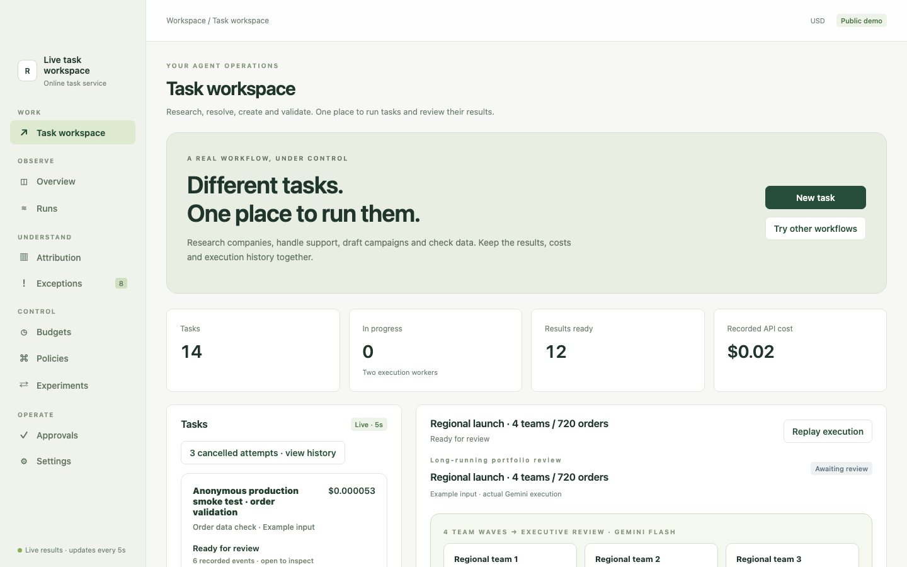
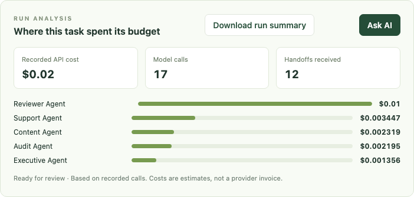

# 用一个真实任务试用 Reins

[English](README.md) · [中文手册](docs/pdf/reins-pilot-zh-CN.pdf) · [English handbook](docs/pdf/reins-pilot-en.pdf)

**用户安装包：**[接入 Skill 与私有仓库入口](customer-install-pack/)。

Agent 跑起来以后，团队往往很难回答几个简单的问题：钱花在了哪一步？它为什么一直调用模型？最后的结果到底能不能用？Reins 把这些信息放回**一次完整任务**里，让团队看清执行过程，再决定哪些支出值得继续。

这套资料帮你把一个现有的 Python 工作流接入 Reins。第一次只记录，不改变 Agent 的执行方式。看过自己的任务记录后，再决定是否加预算规则。

## 先看看产品长什么样

[](https://47.245.114.167:8443/app/#research)

打开[线上演示](https://47.245.114.167:8443/app/#research)，可以选一条已保存的任务，看结果、费用和执行回放。图中使用示例输入，API 费用是按记录估算的；你自己的试用数据保留在自己的环境里。



当团队问“这次任务花了多少钱、是哪个 Agent 花的”时，就看这块。想逐页了解费用归因、预算、结果复核和执行回放，可看[图解产品页面](docs/product-tour.zh-CN.md)。

## 从这里开始

Reins 产品代码在私有仓库中。请联系 Reins 团队取得 `catyans/reins` 的只读权限，然后在 Python 3.10+ 虚拟环境中安装：

```bash
git clone git@github.com:catyans/reins.git /path/to/reins
python -m pip install /path/to/reins
```

在本资料包目录运行不需要 API 密钥的示例：

```bash
python examples/observe_task.py --database /tmp/reins-pilot.duckdb
reins compare --database /tmp/reins-pilot.duckdb --task-type supplier_lookup
```

示例任务和费用是编造的，用来熟悉操作。要真正判断它有没有用，请按[快速上手](docs/quickstart.zh-CN.md)接入自己的一个任务，并记录结果是否合格。之后就能把执行步骤、模型调用、费用和最终结果放在一起看。运行数据保留在你的环境中。

## 接下来读什么

| 资料 | 适合什么时候看 |
| --- | --- |
| [快速上手](docs/quickstart.zh-CN.md) | 接入一个任务、查看记录，以及撤回改动。 |
| [图解产品页面](docs/product-tour.zh-CN.md) | 看当前网页工作台每个页面有什么、能做什么。 |
| [接入指南](docs/integration.zh-CN.md) | 根据模型和 Agent 框架选择接入方式。 |
| [示例代码](examples/) | 参考可运行的写法，或对照接入前后的代码。 |
| [接入 skill](customer-install-pack/skill/reins-integrate/SKILL.md) | 让 Codex 或 Claude Code 为你的代码库准备接入改动。 |

每份指南都有英文版。简短的 PDF 手册适合转给希望离线阅读的同事。

## 用接入 skill 适配现有代码

在本资料包目录运行：

```bash
./scripts/install-skill.sh --target /absolute/path/to/customer-repo --assistant both
```

只使用一种助手时，可改成 `--assistant codex` 或 `--assistant claude`。脚本只会把 skill 复制到你的代码库，不会改动 Agent 业务代码。之后在 Codex 中使用 `$reins-integrate`，在 Claude Code 中使用 `/reins-integrate`。助手会检查一个工作流，在可接入的位置加入观察，并留下改动说明。正式使用前，请检查代码补丁和业务验收条件。移除方法见 `./scripts/install-skill.sh --help`。

Reins 只能记录已接入的调用。观察模式不会拦截支出；预算控制需要另外开启，并先确认费用上界和规则，具体见[接入指南](docs/integration.zh-CN.md)。记录的 API 费用仍可能需要与提供商账单核对。

本资料包以 Apache-2.0 开源。访问权限和试用问题请联系邀请你访问 Reins 私有仓库的人。请勿在公开 issue 中发布密钥或客户资料。

## 编译 PDF 手册

可直接阅读的文件在 [docs/pdf](docs/pdf/) 中。安装 XeLaTeX、`latexmk`、`ctex` 和中文字体后，可从 [LaTeX 源文件](docs/tex/)重新编译：运行 `latexmk -xelatex -output-directory=tmp/pdfs docs/tex/reins-pilot-en.tex`，中文版把文件名换成 `docs/tex/reins-pilot-zh-CN.tex`。
