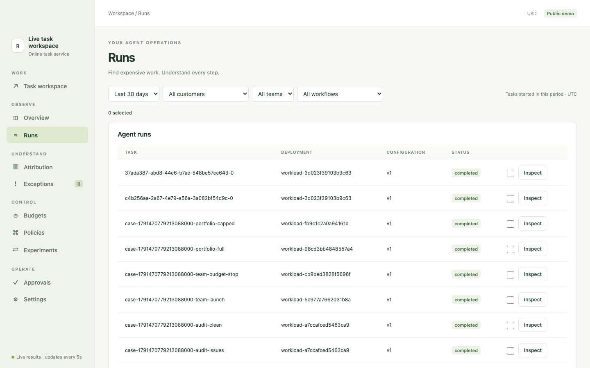

# 根据现有 Agent 选择接入方式

从 Agent 现在使用的调用方式出发，只改需要让 Reins 看见的部分。Reins 要求 Python 3.10+。

| 现在怎样调用 | 先怎样观察 | 以后需要控制支出时 |
| --- | --- | --- |
| OpenAI Chat Completions `.create` 或 Anthropic Messages `.create` | `configure(mode="observe")` + `@trace` + 应用自己的结果验收 | 核实价格、完整输入 token 上界、有限输出上界及客户认可的同提供商模型后，再开启 enforce。 |
| 原生 Gemini 或自定义付费 API／工具 | 用 `Workflow.call` / `acall` 包住每次付费操作，先用 observe | 提供覆盖内部重试的保守 `max_cost`，返回真实费用和用量，审阅后再选择 enforce。 |
| LangChain、CrewAI、OpenAI Agents 回调或 OTel | 回调可补充观察数据 | 回调本身不是付费调用拦截点；控制需显式付费调用路径。 |
| HTTP Proxy | 实验性、只观察 | 控制需改用受支持 SDK 或显式 Workflow。 |

[observe_task.py](../examples/observe_task.py) 是无密钥 SDK 写法；[control_task.py](../examples/control_task.py) 是无密钥显式调用写法，须先运行本地 `reins control serve`；[multi_agent.py](../examples/multi_agent.py) 展示真实子任务与版本化交接。示例价格均为模拟值。

[provider_patterns.py](../examples/provider_patterns.py) 给出可复制的 OpenAI Chat Completions、Anthropic Messages 和原生 Gemini 显式调用函数。传入原有客户端或 provider 适配器；文件内没有密钥。示例中的“文本非空”只占位，必须换成客户业务验收规则。Gemini 适配器须返回真实用量，以及按已核实价格计算的实际费用。

## 接入前后，代码改了什么

[接入前](../examples/customer_before.py)与[接入后](../examples/customer_after.py)使用**同一个 provider 函数、prompt 和业务返回值**。接入后接收 Reins Workflow，用 `workflow.acall` 包住原有 provider 操作。provider 应返回真实用量和费用，或由应用按已核实价格计算。`max_cost` 必须是上界，不是平均预测。业务验收由应用提供；保存了模型回复不等于验收通过。

若第一步只做 SDK 观察，包住完整任务并调用 `record_outcome(success=...)`。`record_retry()` 只记录应用实际发生的重试。`record_external_cost()` 上报已经产生的费用，不拦截支出。不要通过 SDK 和显式 call 对同一费用重复入账。显式 call 内部会抑制嵌套 SDK admission，但仍须覆盖其中全部费用。



接入后可在 **Runs** 中找到该任务，检查执行记录。多 Agent 工作流还可以在任务工作台看到[各 Agent 的费用和交接](images/run-analysis.png)。[图解产品页面](product-tour.zh-CN.md)说明每一页的用途。截图来自公开的完整工作台演示；只接入基础 SDK 观察时，本机时间线会更精简。

## 运行显式示例

在另一个终端启动客户本地的控制服务：

```bash
reins control serve
```

然后运行：

```bash
python examples/control_task.py --token-file ~/.reins/control.token
python examples/multi_agent.py --token-file ~/.reins/control.token
```

这些脚本用本地 operator 凭证建立示例工作流，不请求真实模型。客户生产使用时应分离 operator 与 worker 凭证，由 operator 配置任务和规则，只给可信 worker 分配 worker 凭证。不要把回环地址服务直接暴露到公网。产品控制台和客户代码应运行在客户环境中。

## 用在真实任务前要检查什么

- 身份：标明客户、任务类型、规则版本及父子任务。`operation_inputs` 应描述真实请求，用于识别完全重复操作。
- 结果：使用客户定义的验证器；根任务只有在业务结果合格后才以 `accepted=True` 结束。部分结果须单独审阅。
- 费用：提供商标价只是估算，须与真实账单核对。计算单位经济时，还要纳入工具、评测、基础设施及人工审核费用。超时但费用未知时，预留额保持待核对。
- 恢复：被拒绝的调用不会执行；已发出的请求无法撤销计费。不要自动重试费用不确定的操作。多 Agent 交接只记录版本化状态传递，不证明接收者理解了它。
- 覆盖范围：只有接入的调用会受控。跨主机共享预算、任意框架方法及不支持的提供商特性不属于此内测路径。开启严格控制前，还应核对同版本 Reins 私有仓库 README。
