# 图解 Reins 产品页面

[打开线上工作台](https://47.245.114.167:8443/app/#research) · [English](product-tour.en.md)

以下截图来自 2026 年 10 月 10 日的 Reins 公开演示，展示的是示例输入产生的已保存 Agent 任务。页面中的 API 费用按调用记录估算，不等于提供商账单。客户试用时，自己的工作流与运行数据留在自己的环境；部分操作需要私有工作台的管理员权限。

## 工作：任务工作台

先选一条团队熟悉的任务。左侧切换任务，右侧同时看业务结果与产生结果的执行记录。图中是四个团队检查 720 行订单的示例；工作台里还保存了资料研究、客服、内容制作和数据检查等任务。

往下看 **Run analysis**，就能回答“这次钱花在哪里”。这里列出模型调用次数、收到的 Agent 交接次数，以及各 Agent 的费用。需要和同事复盘时，可下载运行摘要。费用是根据用量记录估算的。

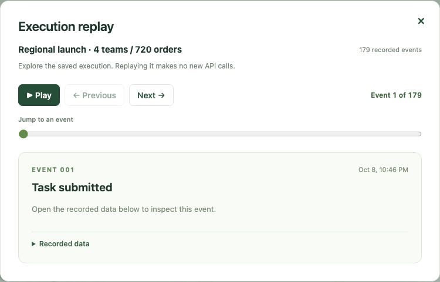

点 **Replay execution** 可以看保存的事件，不会重新运行 Agent。用播放、上一条、下一条或滑杆，定位花费、交接和停止发生在哪一步；展开 **Recorded data** 可看这一事件保存的细节。

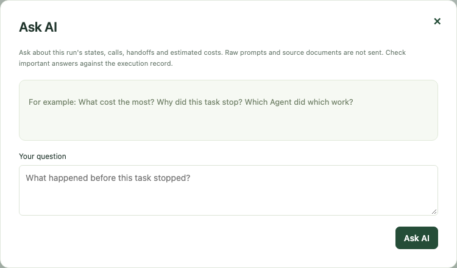

点 **Ask AI** 可针对当前任务提问，比如“哪个 Agent 做了什么”“为什么停止”。它只接收简短的状态、调用、交接和费用记录，不发送原始 prompt 与资料正文。重要回答仍应对照执行记录核实。

## 观察：总览与运行记录

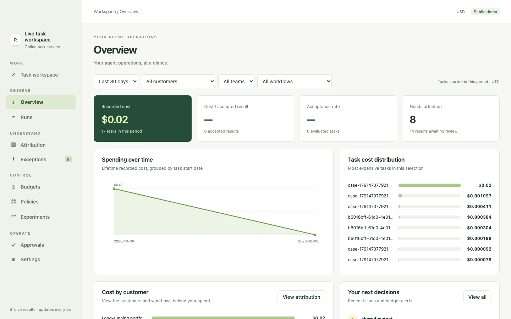

**Overview** 适合负责人先看全局：已记录费用、待复核结果、支出趋势，以及哪些任务构成了总额。演示数据还没有被确认合格的结果，所以“每个合格结果的成本”和“合格率”显示横线，不会编造数字。

**Runs** 是执行记录列表。按时间、客户、团队或工作流筛选，再打开某次运行，检查步骤和费用。任务变慢、变贵或结果异常时，可以从这里追查。

## 看懂费用与问题：归因、异常

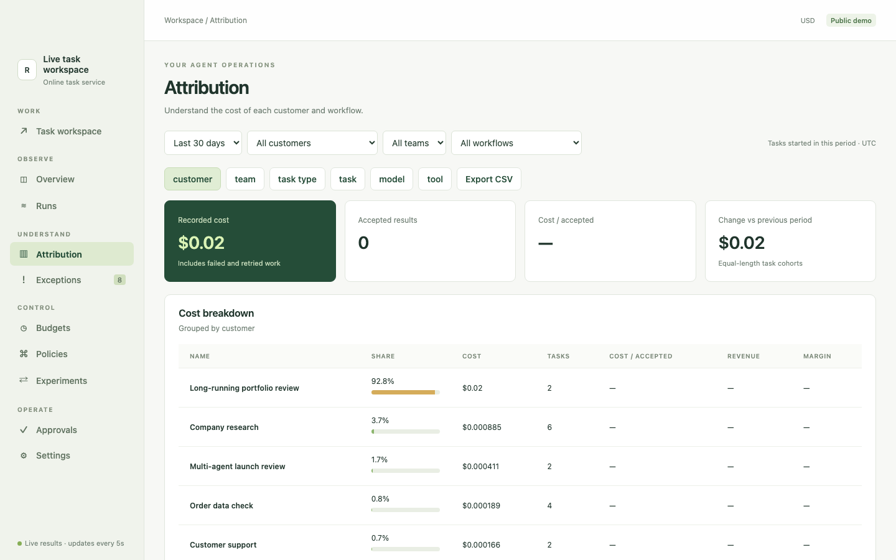

**Attribution** 可按客户、团队、任务类型、任务、模型或工具拆分费用，并导出 CSV。收入和利润率需要企业提供业务数据；Reins 不会仅凭 API 账单推断这些数字。

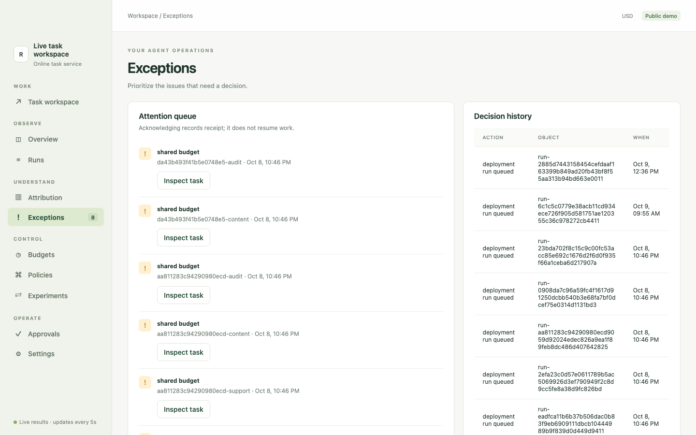

**Exceptions** 集中需要处理的情况。演示中有多个子任务碰到共享预算限制；点开可看受影响的任务和当时的决定。确认收到提示只会留下记录，不会自动恢复任务。

## 控制：预算、策略、实验

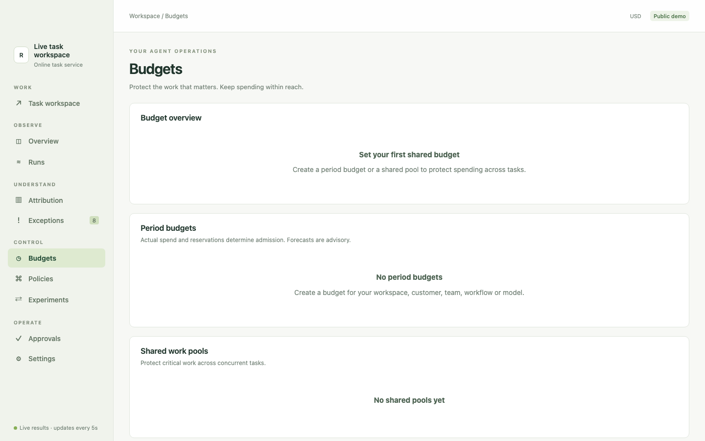

**Budgets** 用来为一段时间的支出或多个并行任务设置共享额度。公开演示尚未配置周期预算和共享池，因此截图展示的是初始状态；单条示例任务仍可带自己的任务预算。

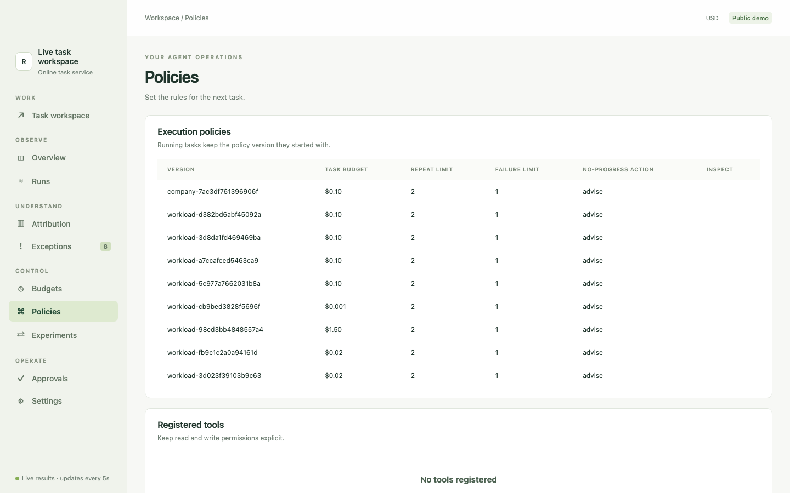

**Policies** 汇总新任务适用的预算、重复次数、失败次数和无进展时的处理方式。运行中的任务沿用启动时的策略版本，后续修改不会暗中改变这次运行。

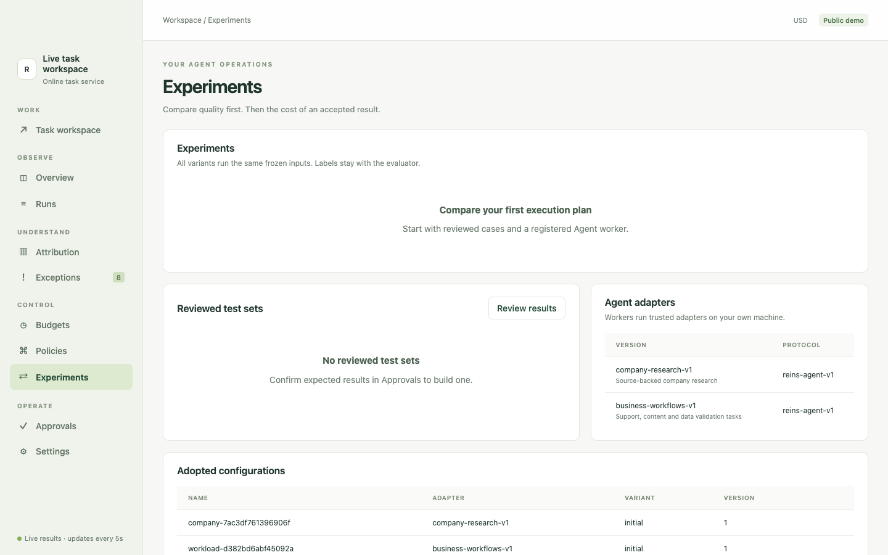

**Experiments** 用于在相同输入上比较不同执行配置。先复核预期结果、注册执行 worker，才能得到有意义的质量和成本对比。演示里能看到适配器，但还没有可展示的实验结果。

## 运营：复核、交接与设置

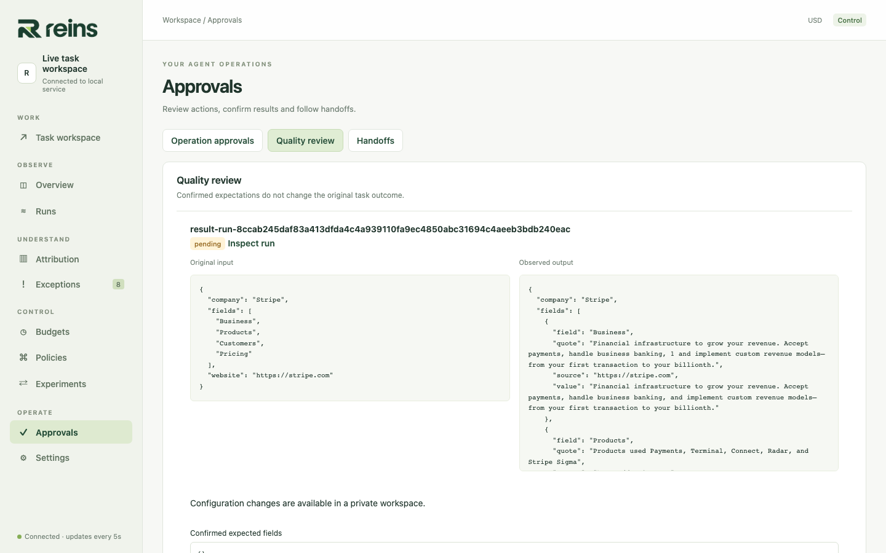

**Approvals → Quality review** 把输入和保存的输出放在一起，供审核人写下预期结果并作出明确判断。程序执行完成，并不自动等于业务结果合格。

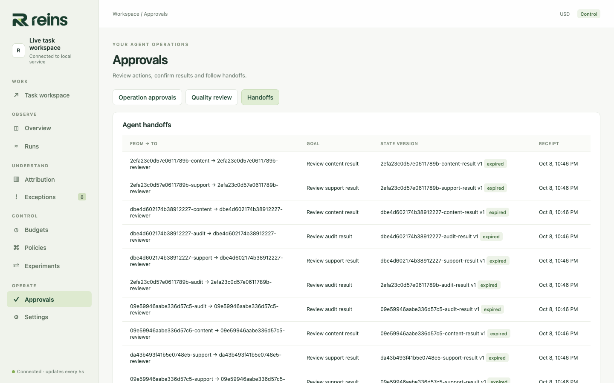

**Approvals → Handoffs** 展示 Agent 之间的交接：谁发给谁、要做什么、状态版本和接收记录。接收记录表示状态已经传递，不证明接收方理解正确。受保护操作的申请会出现在 **Operation approvals** 标签页。

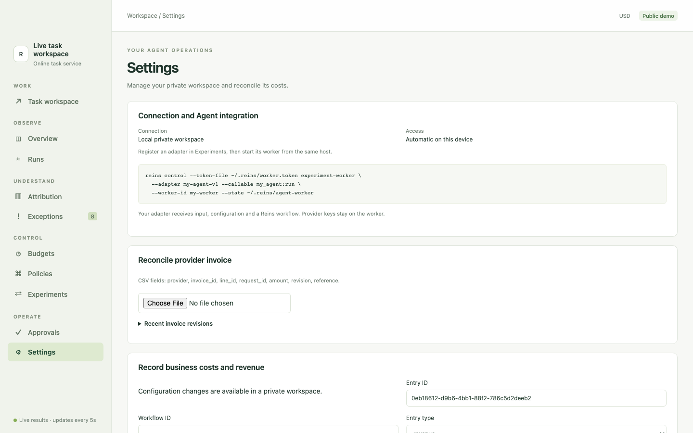

**Settings** 包含工作台连接、Agent worker 接入、提供商账单核对，以及其他业务费用和收入的录入。提供商密钥留在 worker 所在环境。私有工作台的具体配置和权限取决于部署方式。

想接入自己的任务，继续看[快速上手](quickstart.zh-CN.md)；要选择 SDK 或显式调用的接入方式，请看[接入指南](integration.zh-CN.md)。
